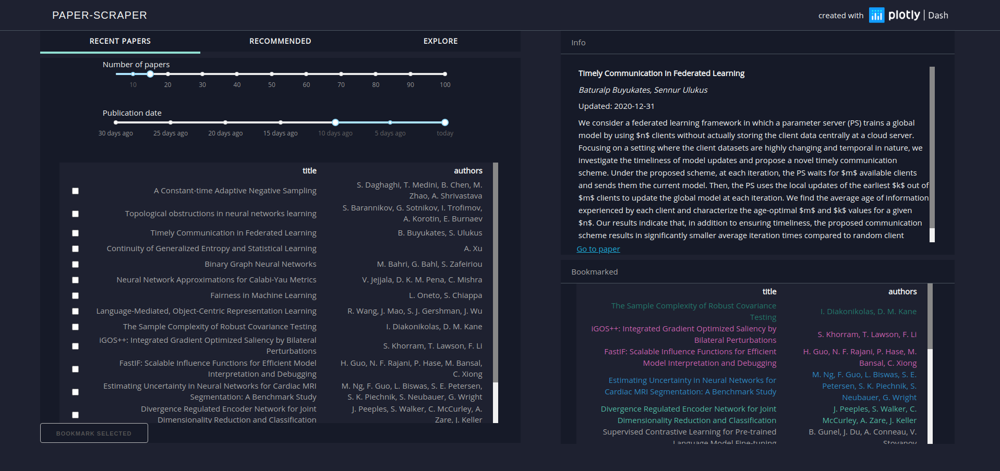

# paper-scraper

Paper-scraper is meant as a tool to interactively explore recent research articles posted on the arXiv. It taylors recommendations by inferring the user's interests from their bookmarked articles. Starting from these recommendations the user can explore related research by traversing a connected network of articles.

## Front end

The frontend is designed to be light-weight, reponsive and intuitive. Its design is largely inspired by [this app](https://github.com/plotly/dash-sample-apps/tree/master/apps/dash-manufacture-spc-dashboard)

The left-hand side column is divided into three tabs: 
- Recent Papers 
- Recommended 
- Explore

The right-hand side column contains an *Info* section that displays detailed information about the selected article (title, authors, abstract) as well as a link to the arXiv database. Furthermore a table displaying all bookmarked items is included in the column.

The *Recent Papers* tab displays recently published or updated articles. The user can decide how many articles from what time period are displayed, and items of interest can be bookmarked.

Based on these bookmarks the *Recommended* tab shows articles that are recommended to the user. If no bookmarks have been saved, this table will be empty. Again, the user can decide how many recommendations are generated and limit the time period from which articles are picked.

The *Explore* tab visualizes bookmarked and recommended articles and their relationships to each other. Article similarities are roughly mapped to distances in the displayed graph and relationships are indicated by connected nodes. Based on a spectral clustering algorithms the articles are grouped into categories and colored accordingly. A corresponding color code is used in the bookmarks table. 

Within the graph, the user can hover over items to display detailed information. Clicking on articles will 'zoom in' on them and show a new network made up of articles similar to the selected one. This can be repeated an arbitrary number of times, allowing the user to traverse the entire corpus of articles. Clicking on the red node, which indicates the selection made in the parent graph, will undo the last zoom.

## Back end and AWS network

The app can be subdivided into four interconnected but independent tasks:

1. Pull the most recent articles from the arXiv database and store them to a local relational data base (RDB)

2. Index the corpus, train and save the necessary NLP models

3. Run an engine that, given a number of articles bookmarked by the user will generate recommendations.

4. Run a web-app that queries both RDB and recommender engine and displays results.

One goal was to run each one of these tasks as containers to facilitate future CI/CD workflows. Amazon services like AWS Lambda as well as Amazon Elastic Container Service were particularly suited to achieve this.

#### 1. arXiv lambda 

Using the [arXiv public API](https://arxiv.org/help/api/basics), or rather, its [python wrapper](https://pypi.org/project/arxiv/), this lambda function is configured to periodically pull the most recent articles from the arXiv data base. At this moment, only articles with the tag "cs.LG" (machine learning) are saved. The code is set up so that it initializes the database and creates all required tables upon first execution. Upon creation the database is filled with the 100,000 most recent articles. AWS EventBridge is set up to trigger this lambda function once a day. In the future this policy could be refined further by taking into account arXiv release schedules. 

Upon successful completion, the "indexing lambda" is triggered

#### 2. Indexing lambda

Once the database is updated it is necessary to index the new articles. The recommendations created by this app are based on a simple document similarity algorithm implemented in [gensim](https://radimrehurek.com/gensim/). It uses tfidf features and a cosine metric to compute similarities between a query document and the document corpus. For efficient retrieval during runtime, gensim indexes the entire corpus and stores the index to disk in a distributed fashion. These index "shards" along with the tfidf-model are created by this lambda function and then stored to a AWS S3 bucket.  

***ECS cluster***

Both recommender engine as well as web-app are run on an Amazon ECS cluster. 

#### 3. Recommender engine

Initially the recommender engine was run as an AWS lambda function but the lack of persistent memory created a high latency in the retrieval of recommendations. Running the engine on a persistent EC2 instance, the NLP models can be loaded from an S3 bucket to memory once and reused until the instance is terminated leading to small response times. 

The engine is run as a [flask](https://flask.palletsprojects.com/en/1.1.x/) server that can be accessed through POST requests to its API. The engine computes similarities between provided query documents and the stored corpus and returns the number of requested most similar documents from the corpus. Along with these documents an adjacency matrix is returned that is used to construct the network graph shown in the *Explore* tab.

#### 4. Web-app

The web-app is programmed entirely with [plotly-dash](https://plotly.com/dash/) as an interactive dashboard. Internally, it interacts with AWS RDS by running SQL queries on its relational database to retrieve information about recent as well as bookmarked papers. The only data stored in the web-app is the one that is being displayed. This means that whenever parameters such as the number of papers to display are changed, a new query is executed. This ensures a low memory usage on the ECS cluster but a relatively high workload on the relational database. Future implementations might improve upon this by intelligently buffering query results. 

Recommendations are created by posting requests to the
recommender engine API. This is during start-up as well as whenever outside parameters such as the number of recommended  articles change. 

If a node in the network graph is clicked, this node is passed to the recommendation engine as a single query document. The ten most similar documents returned are used to populate the zoomed-in version of the network.

## Access

paper-scraper can be accessed at [here](https://tinyurl.com/y4ko4ka) with some caveats. Currently only access as the root user is supported due to the lack of authentification features provided by dash. The website is hosted on a free AWS tier instance which means that I cannot guarantee it's availability in the future. However, if you would like to give it a try, contact me and I will spin up the cluster for you.

Alternatively you can use my [open source code](https://github.com/semodi/arxiv_app) to host your own version of paper-scraper. The only thing required is a Docker installation. 
